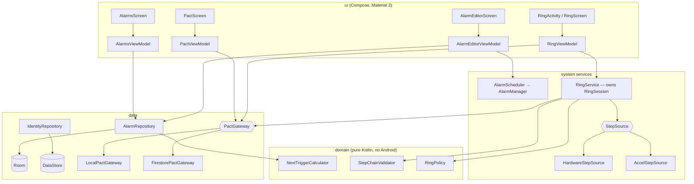

# WakePact — Architecture

One `:app` module, package-by-feature, MVVM with unidirectional data flow, a thin domain layer where real rules live, and a swappable "pact gateway" so the app is fully functional with or without Firebase.

## Layer diagram



## Package map (under `app.wakepact`)

```
core/
  ui/            theme, shared composables (TimeBadge, DayChips, StateRing)
  di/            Hilt modules
  util/          Clock abstraction, dispatchers
domain/          NextTriggerCalculator, StepChainValidator, RingPolicy, model types
data/
  alarm/         AlarmEntity, AlarmDao, AlarmRepository
  identity/      IdentityRepository (DataStore: uid, display name, pact cache)
  pact/          PactGateway (interface), LocalPactGateway, FirestorePactGateway, models
alarmkit/        AlarmScheduler, AlarmReceiver, BootReceiver
ring/            RingService, RingSession, RingActivity, RingScreen, RingViewModel
steps/           StepSource (interface), HardwareStepSource, AccelStepSource
feature/
  alarms/        AlarmsScreen, AlarmsViewModel
  editor/        AlarmEditorScreen, AlarmEditorViewModel
  pact/          PactScreen, PactViewModel
MainActivity.kt, WakePactApp.kt, AppNavHost.kt
```

## How a morning travels through the system

1. `AlarmScheduler` armed an exact `AlarmManager.setAlarmClock` for 07:00 → `AlarmReceiver` fires → starts `RingService` (foreground, media-playback type) and `RingActivity` via full-screen intent.
2. `RingService` creates a `RingSession` (state `RINGING`), starts sound + vibration, publishes the event through `PactGateway`, and starts the `RingPolicy` max-ring timer.
3. `RingViewModel` collects `RingSession.state` and renders the mission. The session subscribes to a `StepSource`; each step event passes through `StepChainValidator` (pure, fully unit-tested); valid chained steps increment progress.
4. Goal reached → session state `PROOF_DONE` → gateway update → sound drops to pending pulse → `RingPolicy` grace timer starts. Solo mode short-circuits: `DEACTIVATED(self)`, stop.
5. A pact member's `PactViewModel` (collecting `PactGateway.pendingEvents`) shows the card; their tap writes `DEACTIVATED`. The owner's session, collecting `PactGateway.eventUpdates(eventId)`, sees it and stops everything. If the grace timer wins instead → `AUTO_CLEARED`; if max-ring wins while still `RINGING` → `MISSED`.
6. Outcome lands in the feed (`PactGateway.feed`) and local history (Room), visible on the Pact screen.

## State, death, and posture
- Alarm list/editor state reloads from Room; in-flight editor fields survive via `SavedStateHandle` keyed by typed route args.
- The ring session lives in `RingService` (not in any composable/VM): rotation, posture changes (fold/unfold), or activity death never reset mission progress. If the *process* dies mid-ring, the sticky service restarts, finds the persisted active ring record, and resumes ringing at full volume (fail-loud beats fail-silent for an alarm).
- All screens hoist state to ViewModels; composables are stateless renderers, so foldable posture changes are pure re-layouts (`WindowSizeClass`).

## Error model
`PactGateway` methods return sealed `GatewayResult` (`Success | Offline | Failed(reason)`). The session and ViewModels translate failures into degraded-but-functional behaviour (solo resolution path + a feed note), never crashes — an alarm app must ring even when the network is gone.

## ADR index
- ADR-001 — Adopt factory defaults (module/MVVM/Hilt/Room/Nav)
- ADR-002 — Dedicated RingActivity + RingService-owned session
- ADR-003 — Optional Firebase via programmatic init behind PactGateway
- ADR-004 — Pluggable StepSource + pure StepChainValidator (anti-spoof)
- ADR-005 — RingPolicy: grace auto-clear and finite max-ring
